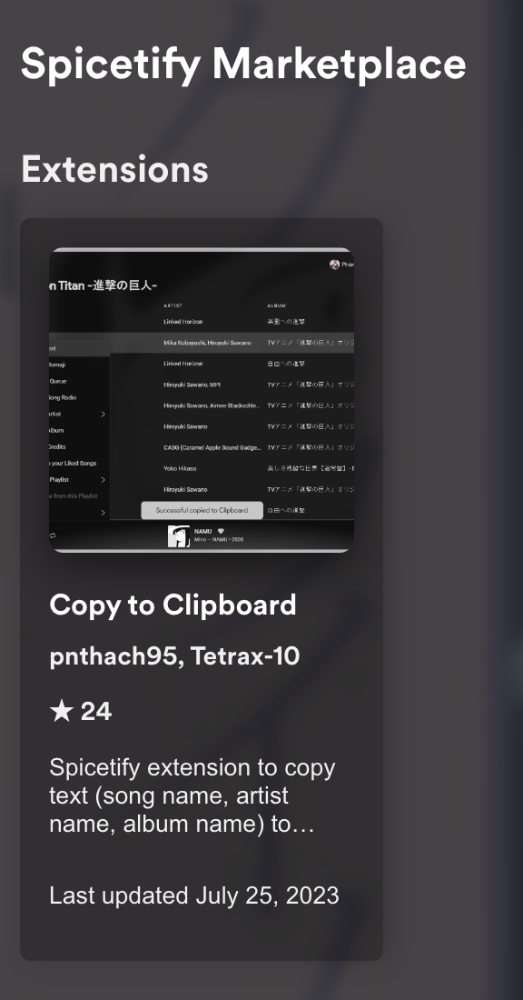

# Copy text extension

Spicetify extension which allows you to copy text (song name, artist name, album name) in Spotify.

## Preview

## Download from Marketplace

  

## Manual Installation

Download [copytoclipboard.js](./dist/copytoclipboard.js) in `dist` folder and follow this [guide](https://spicetify.app/docs/advanced-usage/extensions#installing).

## Note

Some text can't copy, it shows error like this:

