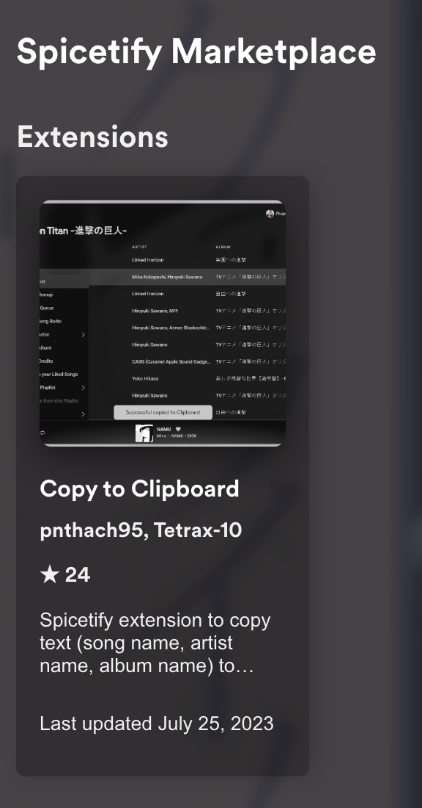

# Copy text extension

# [DO NOT UPDATE SPOTIFY TO LATEST VERSION. CLICK TO READ THE REASON](https://github.com/pnthach95/spicetify-extensions/issues/25)

Spicetify extension which allows you to copy text (song name, artist name, album name) in Spotify.

## Download from Marketplace

  

## Manual Installation

Download [copytoclipboard.js](./dist/copytoclipboard.js) in `dist` folder and follow this [guide](https://spicetify.app/docs/advanced-usage/extensions#installing).

## Settings

You can change separator between song name and artist names at bottom of Settings page

## Note

If you installed from marketplace and it suddenly isn't working, reinstall it (https://github.com/pnthach95/spicetify-extensions/issues/16)

If you encounter any errors, please report with link to the item you want to copy.
